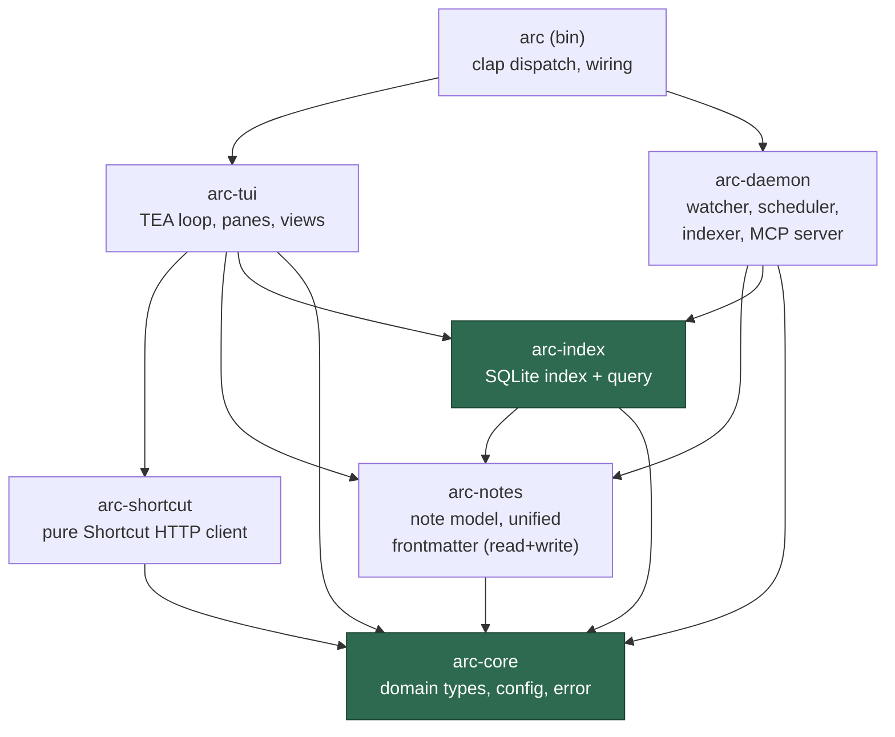

# arc — refactor plan

**Verdict: refactor in place, do not rewrite.** The 8.7k-LOC TUI has good bones — a real Elm/TEA loop, working tmux/worktree/daemon/Shortcut integration. A rewrite throws that away to re-earn the same bugs. Every problem below is a *boundary* problem, and boundaries are exactly what a Cargo workspace split fixes for free: a crate physically cannot import what it doesn't depend on.

## "It's too much code" — it is, but that's duplication, not framework tax

The bloat is *incidental* and dies under deletion, not rewrite. Accounting:

| Bloat | ~LOC recovered | Phase |
|-------|---------------|-------|
| epic/iteration twin panes → one generic `SearchableList<T>` | ~120 | 4 |
| triplicated id-diff (stories/epics/iterations) | ~40 | 3 |
| 5 near-identical `open_*_note_in_editor` → 1 | ~100 | 3 |
| dup sync/async tmux implementations | ~40 | 3 |
| two `Cmd` interpreters merged into one | ~50 | 3 |
| dead code (`keys`/`macros`, write-only frontmatter) | ~150 | 0 |

~1.5–2.5k gone with **negative diff**, landing near ~6k — a fair size for: Shortcut client + fan-out, one-note-per-story + frontmatter, todo extraction, flock-guarded daemon with notifications, tmux + git-worktree integration, and a TUI. The essential parts (daemon flock, worktree fzf, tmux attach, query fan-out) are load-bearing and are *not* where the fat is. A rewrite pays full price to re-earn exactly those.

## The TUI bugs don't need a new framework

Four categories, and three of them are boundary/plumbing bugs the refactor already fixes:

| Bug category | Root cause | Fixed by |
|--------------|-----------|----------|
| Async/effect timing (tabs freeze on fetch, blocking on quit) | two-`Cmd`-interpreter split + hand-rolled mpsc loop | **Phase 3** — one interpreter |
| Input / keybindings (swallowed keys, modal focus, search) | per-pane key routing + hardcoded search-key match | **Phase 4** — unified key routing |
| Features hard to add (new pane touches 3+ files) | leaked boundaries | **Phases 1–4** — crate seams |
| Layout / rendering (misdraw, scroll, resize) | genuinely ratatui-level | **Phase 4b** — dedicated widget pass |

ratatui **is** the established Rust TUI framework — no more-established Rust option exists that would fix these. Only the last row is framework-adjacent, and it's a handful of widget bugs, not an architecture. **Decision: keep ratatui, keep the TEA loop, drain & dedup `arc-tui` in place** (~3k → ~2k). `arc-tui` stays an isolated, swappable crate, so a from-scratch TUI rewrite remains a cheap option *later* if it still chafes — but it's not the starting move.

---

## What's actually wrong (evidence)

Not vague "it's a mess" — five concrete, cross-referencing failures:

| # | Problem | Evidence |
|---|---------|----------|
| 1 | **api ↔ ui are mutually coupled** | `view/*.rs` import raw `api::story::Story` directly (no view-model). Worse, `api/` depends *back* on the UI: `api/iteration/mod.rs:29` and `api/epic/mod.rs:26` impl `LinearListItem` — a **ratatui widget trait** from `custom_list.rs`. The client layer imports a TUI concern. |
| 2 | **Business logic lives in the reducer** | `update.rs` `StoriesLoaded` arm is ~90 lines of data reconciliation (id-set diffing, cache writes) inlined into `update`. The same "skip if id-set unchanged" diff is copy-pasted for stories, epics, iterations. |
| 3 | **Effects handled in two places** | `cmd::execute` interprets some `Cmd`s but `unreachable!()`s on 8 variants that `mod.rs::handle_suspended_cmd` handles instead — doing IO directly on `App` (spawns editors, calls the API client). One enum, two interpreters. |
| 4 | **Copy-paste panes** | `pane/epic_list.rs` and `pane/iteration_list.rs` are near-identical twins (same fuzzy filter, same focus/search handlers, duplicated Msg enums + State structs). `story_list` and `todos_list` each reimplement the same section-nav algorithm. |
| 5 | **Frontmatter is write-only** | `Frontmatter` derives `Deserialize` but **nothing ever reads it** — no `from_str` anywhere. Metadata (story_id, epic, iteration, dates, tags) is written to disk as YAML and never queried. And iteration/epic/daily notes don't even use the struct — they're hand-built `format!` strings with **different field names**. No unified schema, no reader. |

Plus **dead code masked by `pub`**: the build shows 0 warnings only because `pub` items suppress `dead_code`. The write-only `Frontmatter::Deserialize`, `keys.rs` (1 external ref) vs `keybindings.rs`, `macros.rs` (1 ref), the hardcoded `.take(2)` epic rule — all cleanup candidates.

**Data layer today:** three separate persistence mechanisms, none a real DB — `cache.json` (Shortcut API cache), `todos.json` (daemon-maintained todo index, flock-guarded, the one clean structured asset), and write-only frontmatter. Nothing links note → metadata → todos → story.

---

## Target: a Cargo workspace

Aggressive crate split. Each arrow is a dependency; the absence of an arrow is the guarantee. `arc-shortcut` **cannot** import ratatui because it doesn't depend on `arc-tui` — problem #1 becomes structurally impossible, not just discouraged.



| Crate | Owns | Must NOT depend on |
|-------|------|--------------------|
| `arc-core` | domain view-model types, `Config`, `Error` | everything (leaf) |
| `arc-shortcut` | reqwest client, maps API JSON → `arc-core` types | ratatui, arc-tui, notes |
| `arc-notes` | note file model, **readable unified frontmatter**, checkbox parser | reqwest, ratatui |
| `arc-index` *(new)* | rusqlite schema, indexer, read-only query API | ratatui, reqwest |
| `arc-daemon` | notify watcher, scheduler, indexer driver, **MCP server** | ratatui |
| `arc-tui` | TEA `Model`/`Msg`/`update`/`Cmd`, panes, views, `LinearListItem` | reqwest (goes via arc-shortcut) |
| `arc` (bin) | clap CLI, wires subcommands to crates | — |

The two `new` crates (`arc-core`, `arc-index`) are where the separation-of-concerns and the queryable-notes capability actually land. Everything else is *moving existing code across a crate boundary that rejects the bad imports.*

---

## Phases

Ordered so each phase stands on clean ground: **delete → carve crates → decouple → dedup → build the new capability → expose it.**

### Phase 0 — Delete first
Cheapest wins, done before touching architecture. Un-suppress dead code (`#![warn(dead_code)]` on a temporary non-pub build, or `cargo +nightly udeps`), then remove: write-only `Frontmatter` deser (superseded in P4), redundant `keys`/`macros` if folded into `keybindings`, hardcoded `.take(2)`, any orphaned helpers. **Net negative diff.**

### Phase 1 — Workspace skeleton + `arc-core`
Create the workspace `Cargo.toml`; extract `arc-core` (config, error, and the **domain view-model types** — the app's own `Story`/`Iteration`/`Epic`, not the wire types). Nothing behaviour-changes yet; this is the seam everything else hangs off.

### Phase 2 — Carve `arc-shortcut`, break the api→ui cycle
Move `api/` into `arc-shortcut`. It maps responses → `arc-core` types. Move the `LinearListItem` impls out of the client and into `arc-tui`. Pull the baked query strings / fan-out / `.take(2)` out of the client into caller-side domain logic. **Fixes #1 permanently.**

### Phase 3 — Carve `arc-tui`, drain the reducer
Move `app/` + `view/` into `arc-tui`. Extract the reconciliation logic (the 90-line `StoriesLoaded` arm, the triplicated id-diff) into plain domain functions in `arc-core`. Unify the `Cmd` interpreter into **one** place — delete the `handle_suspended_cmd` / `cmd::execute` split. Consolidate the 5 near-identical `open_*_note_in_editor` fns and the dup sync/async tmux code. **Fixes #2, #3.**

### Phase 4 — Dedup panes + unify input
One generic `SearchableList<T>` collapses the epic/iteration twins; one section-nav helper serves story + todos. Unify key routing — kill the hardcoded three-place search-key match so a new searchable view is one registration, not three edits. **Fixes #4 + the input/keybinding bugs.**

### Phase 4b — TUI rendering pass
The one genuinely ratatui-level bucket: the layout/scroll/resize misdraws. Isolated widget fixes (not architecture) once the panes are deduped and there's a single place per widget to fix.

### Phase 5 — `arc-notes` + unified readable frontmatter
Extract note model into `arc-notes`. **One** `Frontmatter` struct for all note types (kill the `format!` templates), with a real reader (`serde_yaml::from_str`) and a migration for the old inconsistent field names. This is the prerequisite for querying. **Fixes #5.**

### Phase 6 — `arc-index`: notes as a database
New crate. **rusqlite** SQLite index at `{cache_dir}/arc.db`, replacing `todos.json` (with a one-shot import). The daemon's indexer parses each note → rows in `notes`, `todos`, and link tables joining note ↔ story/epic/iteration. The daemon already watches the FS and keeps todos fresh — this extends that job from "flat JSON of todos" to "queryable index of everything". SQLite turns "build a query engine" into "write SQL" — no bespoke DSL.

### Phase 7 — MCP server inside the daemon
`arc daemon run` gains an MCP server (`rmcp`) over the shared index — one process, one source of truth, no cross-process sync. Two tools, minimal surface:

```
query(sql: string) -> rows      # read-only; rejects writes
get_note(id) -> markdown        # full note body from disk
```

One SQL-passthrough tool beats a dozen bespoke ones: maximum power, least code, no new tool per new question. Read-only to start (open-connection flag + statement check); write tools can come later if wanted.

---

## Sequencing notes

- **P0–P4 are pure refactor** — no behaviour change, each ends green (`cargo test`, manual TUI smoke). Shippable independently; you can stop after P4 and just have a clean codebase.
- **P5–P7 are the new capability** — they depend on the clean note boundary from P5 but not on each other being perfect.
- Do the crate carves (P1–P3) as move-then-fix: move files, let the compiler list every illegal import, fix upward. The borrow checker + missing deps make an incomplete decoupling *fail to compile* — the split can't be half-done.

**Skipped deliberately:** typed-per-query MCP tools (SQL passthrough covers it), a separate MCP binary (daemon already persistent), any ORM (rusqlite + SQL is less code). Add typed tools when an LLM caller demonstrably struggles with raw SQL.
